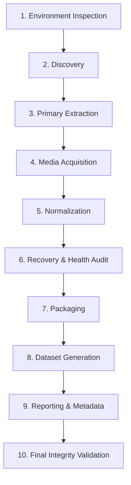

# WordPress Scraping & Migration Agent Pipeline

An autonomous, resilient agent-driven scraping and migration pipeline designed to extract, normalize, map relationships, and package WordPress sites into clean, standardized delivery bundles ready for database migration and modern headless CMS platforms.

---

## 🌟 Key Features

- **Autonomous Agent & Modular Tool Architecture**: 19 specialized tools managed by a centralized `ToolRegistry` supporting capability search, tool lifecycle states (`READY`, `UNTESTED`, `BROKEN`, `DEPRECATED`), and automated version bumping.
- **Resilient HTTP Engine**: Built-in exponential backoff with jitter, custom connection timeouts, streaming chunk verification, and automatic classification of errors (`NETWORK_ERROR`, `TIMEOUT`, `RATE_LIMIT`, `HTTP_403`, `HTTP_404`, `SSL_ERROR`).
- **Post <-> Media Relationship Mapping**: Robust 3-strategy heuristic resolution linking posts to their featured images, Gutenberg `wp-image-{id}` markup, and in-body URL references with thumbnail/scaled (`-scaled`, `-WxH`) deduplication.
- **Hierarchical Per-Post Packaging**: Clean output structure organized by publication date: `YYYY/MM/<post_id>-<slug>/` with `public/` (`post.json`, `content.html`, `content.md`), `image/`, `attachments/`, and conditional `missing_media.txt`.
- **Atomic State Checkpointing**: Persistent pipeline context (`workspace/state/run_context.json`) supporting one-command interruption recovery and resumption.
- **Comprehensive Delivery & Integrity Auditing**: Automated 9-point pre-delivery integrity validator, CSV audit reports (`missing_media.csv`, `external_media.csv`, `download_errors.csv`), migration summary, and dynamic `manifest.json`.

---

## 📁 Repository Structure

```text
├── run_pipeline.py               # Main CLI entry point
├── requirements.txt              # Project dependencies
├── README.md                     # Project documentation
├── .gitignore
│
├── src/                          # Core Framework
│   ├── config.py                 # Central configuration and path definitions
│   ├── cli.py                    # Rich-powered command-line interface
│   ├── agent/                    # Agent orchestration
│   │   ├── orchestrator.py       # ScrapingAgent planner & phase executor
│   │   ├── registry.py           # ToolRegistry & ToolMetadata
│   │   └── state.py              # StateManager & atomic checkpointing
│   ├── tools/                    # 19 Modular Tools
│   │   ├── discovery.py          # WP REST API discovery
│   │   ├── scrapers.py           # Posts, media, categories, tags scrapers
│   │   ├── downloaders.py        # Streamed media acquisition
│   │   ├── normalizers.py        # Post/media schemas & relation mapping
│   │   ├── recovery.py           # Disk validation & concurrent URL recovery
│   │   ├── packagers.py          # Per-post directory packaging
│   │   ├── formatters.py         # Master JSON & CSV datasets
│   │   ├── reporters.py          # Audit reports & migration summary
│   │   ├── delivery.py           # Dynamic manifest & handover README
│   │   └── validators.py         # Export integrity validation
│   └── utils/                    # Shared Utilities
│       ├── http_client.py        # ResilientHttpClient with retry policies
│       ├── html_to_md.py         # HTML to Markdown converter
│       └── logging.py            # Structured JSON & Rich logger
│
├── tests/                        # Automated Pytest Suite
│   ├── test_registry.py          # Tool registry lookup & version bumping
│   ├── test_normalizers.py       # HTML-to-MD & media reference extractors
│   ├── test_packagers.py         # Packaging & integrity validation
│   └── test_recovery.py          # Recovery logic & error classification
│
├── workspace/                    # Internal Staging Directory (git-ignored)
│   ├── raw/                      # Raw JSON dumps from REST API
│   ├── normalized/               # Standardized posts, media & mapping schemas
│   ├── media/                    # Local media staging & recovered assets
│   ├── state/                    # Checkpoints & execution state
│   └── logs/                     # JSONL tool execution logs
│
├── output/                       # Standardized Customer Delivery Bundle
│   ├── data/                     # Master JSON & CSV datasets
│   ├── reports/                  # Missing media, external assets & summaries
│   ├── manifest.json             # Dynamic delivery metadata & statistics
│   ├── README.md                 # Customer delivery guide
│   └── YYYY/MM/<post_id>-<slug>/ # Packaged per-post folders
│
└── legacy/                       # Archived Prototype Scripts (git-ignored)
```

---

## 🚀 Getting Started

### 1. Prerequisites
- **Python 3.10+** (Python 3.11 / 3.12 / 3.13 fully supported)
- Windows, macOS, or Linux

### 2. Installation
Clone the repository and install the dependencies:

```bash
git clone https://github.com/keith1101/Web-Scraper.git
cd Web-Scraper

# Create and activate virtual environment (optional but recommended)
python -m venv .venv
source .venv/bin/activate  # On Windows: .venv\Scripts\activate

# Install dependencies
pip install -r requirements.txt
```

### 3. Configuration
Default settings are managed in [`src/config.py`](file:///d:/Project/Web%20Scraper/src/config.py) and can be overridden via environment variables or a `.env` file:

```env
SOURCE_URL=https://abi.com.vn
HTTP_TIMEOUT=15
HTTP_MAX_RETRIES=3
USER_AGENT=Mozilla/5.0 (Windows NT 10.0; Win64; x64) AppleWebKit/537.36
```

---

## 💻 CLI Usage

The pipeline is operated via the unified `run_pipeline.py` CLI:

### 1. Run Complete Pipeline
Execute all 10 phases from discovery to packaging and final validation:

```bash
python run_pipeline.py run
```
*To re-fetch all raw datasets from the WordPress REST API, pass `--force-refresh`:*
```bash
python run_pipeline.py run --force-refresh
```

### 2. Resume Interrupted Run
Resume execution automatically from the last completed checkpoint:

```bash
python run_pipeline.py resume
```

### 3. Check Live Pipeline Status
Inspect current run metrics, active phase, and completed tools:

```bash
python run_pipeline.py status
```

### 4. View Tool Catalog
Display all 19 registered tools with their versions, status, and capabilities:

```bash
python run_pipeline.py tools
```

### 5. Validate Delivery Package
Run the 9-point pre-delivery integrity validator against `output/`:

```bash
python run_pipeline.py validate
```

---

## 🔄 Pipeline Execution Phases



1. **Environment Inspection**: Validates directories, disk permissions, and target connectivity.
2. **Discovery**: Queries `/wp-json/` to identify available routes, taxonomies, and schema types.
3. **Primary Extraction**: Scrapes posts, media metadata, categories, and tags via REST pagination.
4. **Media Acquisition**: Streams original media files into `workspace/media/` preserving `YYYY/MM` paths.
5. **Normalization**: Standardizes schemas, converts HTML to Markdown, and maps Post <-> Media relations.
6. **Recovery & Health Audit**: Scans for missing/0-byte assets, retries unmapped URLs concurrently, and classifies unrecoverable references.
7. **Packaging**: Organizes posts into `YYYY/MM/<post_id>-<slug>/` with localized assets and conditional `missing_media.txt`.
8. **Dataset Generation**: Exports master JSON and flattened CSV datasets into `output/data/`.
9. **Reporting & Metadata**: Generates audit reports (`missing_media.csv`, `external_media.csv`, etc.), dynamic `manifest.json`, and delivery `README.md`.
10. **Final Integrity Validation**: Performs pre-delivery checks (schema validation, zero-byte file checks, count reconciliations).

---

## 📦 Delivery Package Structure

The final output is generated in [`output/`](file:///d:/Project/Web%20Scraper/output/):

```text
output/
├── data/
│   ├── posts.json               # Canonical posts dataset
│   ├── posts.csv                # Flattened posts for spreadsheet review
│   ├── media.json               # Canonical media metadata
│   ├── media.csv                # Flattened media catalog
│   ├── post_media_mapping.json  # Post <-> Media relationship records
│   └── post_media_mapping.csv   # Relational mapping in CSV format
│
├── reports/
│   ├── missing_media.csv        # Broken or unreachable media references
│   ├── external_media.csv       # Assets hosted on third-party domains
│   ├── download_errors.csv      # Failed download attempts & HTTP codes
│   ├── migration_summary.txt    # Human-readable executive summary
│   └── validation.json          # Results of 9-point integrity checklist
│
├── manifest.json                # Delivery manifest with dynamic statistics
├── README.md                    # Customer handoff instructions
│
└── YYYY/
    └── MM/
        └── <post_id>-<slug>/
            ├── public/
            │   ├── post.json    # Normalized post metadata
            │   ├── content.html # Clean raw HTML
            │   └── content.md   # Converted Markdown
            ├── image/           # Images referenced by or attached to this post
            ├── attachments/     # PDF, DOCX, and document attachments
            └── missing_media.txt# Generated ONLY if post has unresolved media
```

---

## 🧪 Testing

Run the automated test suite with `pytest`:

```bash
pytest -v
```

### Test Suite Coverage:
- `test_normalizers.py`: Tests HTML-to-Markdown conversion, Gutenberg `wp-image-{id}` extraction, and media URL regex matching.
- `test_packagers.py`: Tests per-post directory packaging and export validation rules.
- `test_recovery.py`: Tests error classification, status categorization, and missing asset handling.
- `test_registry.py`: Tests tool registration, version bumping, and semantic capability lookups.

---

## 🛠️ Adding New Tools

To create a new tool in the pipeline, inherit from `BaseTool` and register it with the `@registry.register` decorator:

```python
from typing import Any, Dict
from src.tools.base import BaseTool
from src.agent.registry import ToolMetadata, ToolStatus, registry

@registry.register
class CustomEnrichmentTool(BaseTool):
    metadata = ToolMetadata(
        name="enrich_posts",
        version="1.0.0",
        description="Enriches post content with custom metadata or NLP tags.",
        input_schema={"type": "object"},
        output_schema={"type": "object", "properties": {"enriched_count": {"type": "integer"}}},
        capabilities=["enrichment", "nlp"],
        dependencies=["normalize_posts"],
        status=ToolStatus.READY,
    )

    def _execute(self, **kwargs) -> Dict[str, Any]:
        # Implementation logic here
        return {"enriched_count": 245}
```

---

## 📄 License
This project is licensed under the MIT License.
